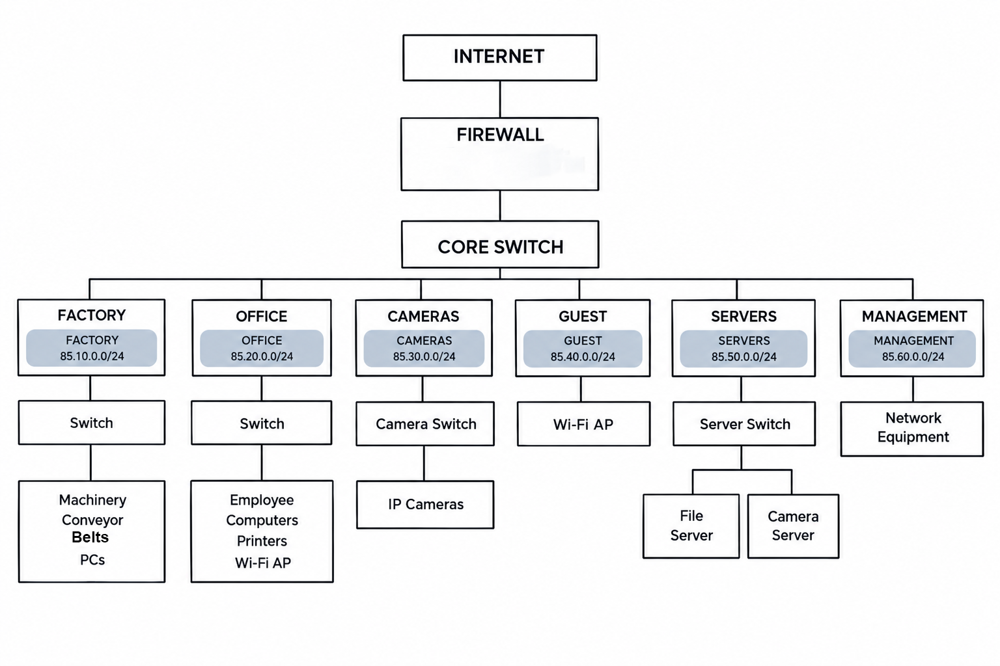

# IS355 Networking and Cyber Security

## Group Members

| Student Name      | Student ID | Student Email                                           |
| ----------------- | ---------: | ------------------------------------------------------- |
| Zane Schutzman    |    1924285 | [zwschutzman@loyola.edu](mailto:zwschutzman@loyola.edu) |
| Owen Steinetz     |    1928302 | [omsteinetz@loyola.edu](mailto:omsteinetz@loyola.edu)   |
| Gbemiro Omokayode |    1904384 | [gdomokayode@loyola.edu](mailto:gdomokayode@loyola.edu) |
| Charlie DiNapoli  |    1906216 | [cjdinapoli@loyola.edu](mailto:cjdinapoli@loyola.edu)   |

---

## Communication Plan

We will use an iMessage group chat, which we have already created, to communicate throughout the project.

We will communicate every week to discuss:

* What we have completed
* What still needs to be done
* What we will work on next

We will aim to complete one or two tasks each week.

---

## Tasks

| Task                                            | Name |
| ----------------------------------------------- | ---- |
| Form project group and create GitHub repository |  All    |
| Create project plan and communication schedule  |  All    |
| Identify assumptions and requirements           |  Zane    |
| Design the network                              |     |
| Create network diagram                          |  Zane    |
| Develop IP addressing plan                      |      |
| Recommend network hardware                      |      |
| Research cloud providers                        |      |
| Complete cloud service pricing comparison       |      |
| Compare backup strategies                       |      |
| Conduct cyber security risk assessment          |      |
| Recommend security controls                     |      |
| Review and improve network design               |      |
| Complete final report                           |      |
| Prepare final submission                        |      |

---

## Project Timeline

### Week 4

* Form group
* Create GitHub repository
* Create project plan

### Week 5

* Assumptions
* Requirements
* Begin network design

### Week 6

* Network design
* IP addressing

### Week 7

* Network diagram
* Hardware recommendations

### Week 8

* Upload draft network design to GitHub

### Week 9

* Cloud provider research
* Pricing

---

# Assumptions and Requirements

## Requirements

* The company has two attached buildings: a factory and an office building.
* The factory normally has 20 to 25 workers.
* The office normally has 30 to 40 staff.
* The factory contains network-controlled machinery and conveyor belts.
* Factory machinery can use wired LAN or wireless Wi-Fi connections.
* Factory computers monitor and control the machinery.
* Office and factory users have both wired and wireless devices.
* The company has general-purpose office printers.
* The company has specialized printers, including large engineering printers and 3D printers.
* The company will use IP-based security cameras throughout the buildings.
* Security cameras will send video to a local server in the office.
* The company will use some cloud services, including a public website and email.
* Important information such as engineering designs and financial information will remain on local office servers.
* The network must contain at least three IP subnets: factory, office, and security cameras.
* Only `/24` and `/16` network masks may be used.
* Every IP address used in the network design must begin with the last two digits of one of the group members' student IDs.

## Assumptions

* The company will have one primary internet connection.
* A firewall will be placed between the company's internal network and the internet.
* Managed network switches will be used to support network segmentation.
* Separate networks will be used for factory devices, office devices, security cameras, and other specialized devices where appropriate.
* Wireless access points will be used to provide Wi-Fi throughout the office and factory.
* Guest wireless devices will be separated from the company's internal networks.
* The company will use local servers for important engineering and financial information.
* A local server will be used to store security camera footage.
* Network equipment and servers will be located in secure areas with restricted physical access.
* The network will use security controls such as firewalls, network segmentation, access controls, and regular backups.

---

# Network Design

## IP Addressing

The network will be divided into six separate `/24` subnets. Network segmentation will separate factory equipment, office devices, security cameras, guest devices, servers, and network management traffic.

| Network            | IP Address Range | Purpose                                                  |
| ------------------ | ---------------- | -------------------------------------------------------- |
| Factory            | 85.10.0.0/24     | Factory machinery, conveyor belts, and factory computers |
| Office             | 85.20.0.0/24     | Office computers, laptops, and printers                  |
| Security Cameras   | 85.30.0.0/24     | IP security cameras                                      |
| Guest Wi-Fi        | 85.40.0.0/24     | Guest wireless devices                                   |
| Servers            | 85.50.0.0/24     | Local company servers                                    |
| Network Management | 85.60.0.0/24     | Management of network equipment                          |

### Device IP Addresses

| Device | IP Address | Network |
|---|---|---|
| Firewall | 85.10.0.1 | Network Gateway |
| Core Switch | 85.60.0.1 | Management |
| Factory Switch | 85.60.0.2 | Management |
| Office Switch | 85.60.0.3 | Management |
| Camera Switch | 85.60.0.4 | Management |
| Server Switch | 85.60.0.5 | Management |
| Factory PCs | 85.10.0.10–85.10.0.34 | Factory |
| Office Computers | 85.20.0.10–85.20.0.49 | Office |
| IP Cameras | 85.30.0.10–85.30.0.59 | Cameras |
| Guest Devices | 85.40.0.10–85.40.0.99 | Guest |
| File Server | 85.50.0.10 | Servers |
| Camera Server | 85.50.0.11 | Servers |

### Recommended Network Hardware

| Hardware | Quantity | Minimum Specifications | Purpose |
|---|---:|---|---|
| Firewall | 1 | Enterprise firewall, VLAN support, VPN support, traffic filtering, and at least 1 Gbps throughput | Protects the internal network and controls internet traffic |
| Core Switch | 1 | Managed Layer 3 switch, VLAN support, Gigabit Ethernet, and enough ports for all network connections | Connects the company's different network segments |
| Factory Switch | 1+ | Managed Gigabit switch, VLAN support, and industrial/environmental suitability | Connects factory machinery, conveyor belts, and factory PCs |
| Office Switch | 1+ | Managed Gigabit switch with VLAN support and sufficient Ethernet ports | Connects office computers, printers, and access points |
| Camera Switch | 1+ | Managed PoE switch with Gigabit Ethernet and enough PoE ports | Connects and powers IP security cameras |
| Server Switch | 1 | Managed Gigabit switch with VLAN support | Connects the local servers |
| Wireless Access Points | 4+ | Wi-Fi 6 or newer, VLAN support, WPA3, and business/enterprise management | Provides wireless connectivity throughout the buildings |
| File Server | 1 | Business-class server, redundant storage/RAID, and sufficient storage for company files | Stores engineering designs and financial information |
| Camera Server | 1 | Business-class server with high-capacity storage and RAID | Stores security camera footage |
| UPS | 2+ | Battery backup with surge protection and sufficient capacity for network/server equipment | Keeps critical network equipment running during short power interruptions |

### Hardware Recommendations

The recommended hardware supports the size and requirements of the company's factory and office networks. Managed switches are used so that the different network subnets can be separated and managed. A PoE switch is recommended for the security cameras because IP cameras can receive both network connectivity and power through Ethernet.

Wireless access points will provide Wi-Fi throughout the factory and office while supporting the network segmentation used in the design. The company will also use local servers for important engineering and financial information and for storing security camera footage.

A firewall will be placed between the internet and the internal network to provide traffic filtering and network protection. UPS devices are recommended for critical network and server equipment to reduce disruption caused by short power outages.

### Network Design Explanation

The network is divided into separate subnets for the factory, office, security cameras, guest Wi-Fi, servers, and network management. This separation allows different types of devices and users to be managed independently.

The factory network contains the company's network-controlled machinery, conveyor belts, and factory PCs. The office network contains employee computers, printers, and wireless access points. The security camera network is separated from the other networks because the cameras continuously send video to the local camera server.

The guest network provides wireless access for visitors without placing guest devices directly on the company's internal networks. The server network contains the local file and camera servers. A separate management network is used for managing network infrastructure.

A firewall is positioned between the internet and the internal network. The core switch connects the different network segments and allows the network to be centrally connected.

